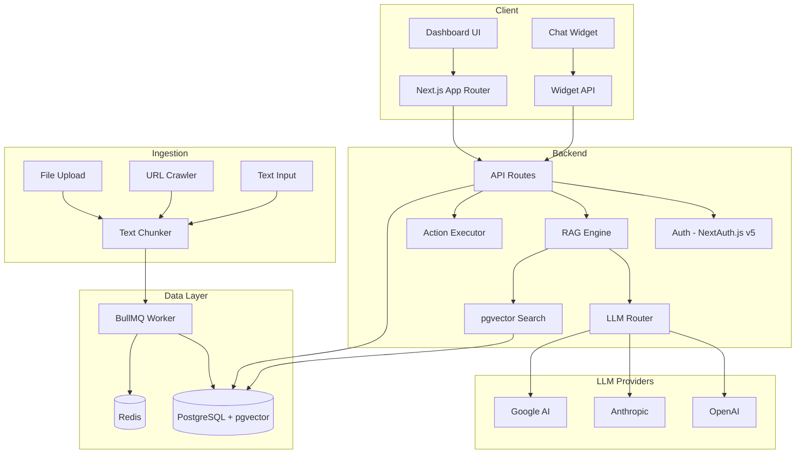

# AgentForge

A self-hosted AI customer service chatbot platform. Upload your company data, train AI agents, and deploy embeddable chat widgets on your websites. Agents answer questions using RAG (Retrieval-Augmented Generation) and can take real-world actions via API calls.

**Key Differentiator**: BYOK (Bring Your Own Key) — users provide their own OpenAI/Anthropic/Google API keys. No credit-based pricing. Unlimited messages.

## Architecture



## Tech Stack

| Layer | Technology |
|-------|-----------|
| Frontend | Next.js 14 (App Router) + React 18 + TypeScript |
| Styling | TailwindCSS + shadcn/ui |
| Backend | Next.js API Routes |
| Database | PostgreSQL 16 + Prisma ORM |
| Vector Store | pgvector extension |
| Auth | NextAuth.js v5 (credentials + Google OAuth) |
| File Processing | pdf-parse, mammoth, papaparse |
| Web Scraping | cheerio |
| Embeddings | OpenAI text-embedding-3-small (1536 dims) |
| LLM Gateway | openai, @anthropic-ai/sdk, @google/generative-ai |
| Job Queue | BullMQ + ioredis |
| Widget | Standalone Preact bundle (Shadow DOM) |
| Deployment | Docker Compose |

## Features

- **Multi-LLM Support**: GPT-4o, Claude 3.5 Sonnet, Gemini 2.0 Flash
- **RAG Chat Engine**: Upload PDFs, crawl websites, or paste text — agents answer from your data
- **Embeddable Widget**: One script tag to deploy on any website
- **AI Actions**: Agents can call APIs, collect leads, send Slack notifications
- **Analytics**: Conversation tracking, sentiment analysis, topic detection
- **Lead Capture**: Collect and export leads from conversations
- **Integrations**: Slack, webhooks/Zapier, REST API
- **BYOK**: Users bring their own API keys — encrypted at rest (AES-256-GCM)

## Quick Start

### Prerequisites

- Node.js 20+
- PostgreSQL 16 with pgvector extension
- Redis 7+

### Setup

```bash
cd agentforge

# Install dependencies
npm install

# Configure environment
cp .env.example .env
# Edit .env with your database URL, secrets, etc.

# Set up database
npx prisma generate
npx prisma db push

# Apply pgvector extensions
psql $DATABASE_URL -f prisma/migrations/0001_enable_pgvector.sql

# Start development server
npm run dev
```

### Docker (Recommended)

```bash
cd docker

# Copy and configure environment
cp .env.example .env

# Start all services
docker compose up -d
```

This starts PostgreSQL (with pgvector), Redis, the Next.js app, and the BullMQ worker.

## Environment Variables

| Variable | Description | Required |
|----------|-------------|----------|
| `DATABASE_URL` | PostgreSQL connection string | Yes |
| `REDIS_URL` | Redis connection string | Yes |
| `NEXTAUTH_SECRET` | Secret for NextAuth.js session encryption | Yes |
| `NEXTAUTH_URL` | Base URL of the application | Yes |
| `ENCRYPTION_SECRET` | Secret for API key encryption (AES-256-GCM) | Yes |
| `GOOGLE_CLIENT_ID` | Google OAuth client ID | No |
| `GOOGLE_CLIENT_SECRET` | Google OAuth client secret | No |

## Project Structure

```
agentforge/
  src/
    app/                    # Next.js App Router
      (auth)/               # Auth pages (login, register)
      (dashboard)/          # Protected dashboard pages
        agents/             # Agent management
        settings/           # User settings
      api/                  # API routes
        agents/             # Agent CRUD + chat + sources
        auth/               # Authentication endpoints
        settings/           # Settings API
        widget/             # Public widget API
        v1/                 # Public REST API
    components/             # React components
      ui/                   # shadcn/ui components
    lib/                    # Core utilities
      auth.ts               # NextAuth configuration
      db.ts                 # Prisma client
      encryption.ts         # API key encryption
      llm.ts                # LLM router (OpenAI/Anthropic/Google)
      rag.ts                # RAG chat engine
      chunker.ts            # Text chunking
      crawler.ts            # Web crawler
      file-parser.ts        # PDF/DOCX/CSV parsing
      embeddings.ts         # OpenAI embeddings
      ingest.ts             # Data ingestion orchestrator
    workers/                # Background job processors
    types/                  # TypeScript definitions
  widget/                   # Standalone Preact chat widget
  prisma/                   # Database schema and migrations
  docker/                   # Docker configuration
```

## Widget Embedding

After creating an agent, embed the chat widget on any website:

```html
<script src="https://your-domain.com/widget.js" data-agent-id="your-agent-id"></script>
```

## API

The REST API is available at `/api/v1/`:

- `GET /api/v1/agents` — List agents
- `GET /api/v1/agents/:id` — Get agent details
- `POST /api/v1/agents/:id/chat` — Chat with agent (streaming)
- `GET /api/v1/agents/:id/conversations` — List conversations
- `GET /api/v1/agents/:id/leads` — List captured leads

## License

MIT
